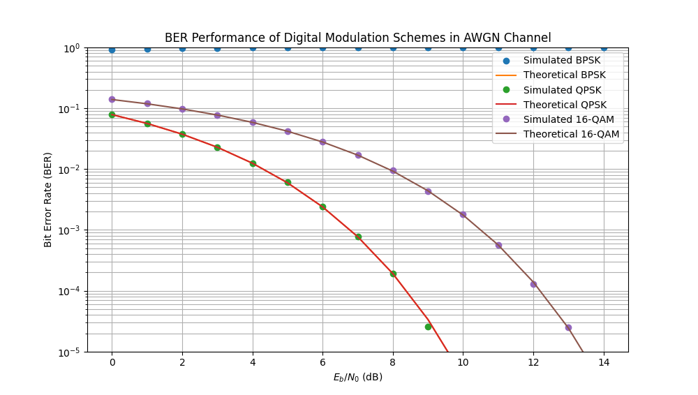

# BER Performance Simulation of Digital Modulation Schemes

This project provides a Python-based simulation to analyze and visualize the Bit Error Rate (BER) performance of several fundamental digital modulation schemes—BPSK, QPSK, and 16-QAM—over an Additive White Gaussian Noise (AWGN) channel.

The simulation results are plotted against the theoretical BER curves to validate the implementation and demonstrate the trade-offs between spectral efficiency and noise immunity for each scheme.



---

## Core Concepts 📡

* **Digital Modulation:** The process of encoding digital data (bits) onto an analog carrier signal.
    * **BPSK (Binary Phase Shift Keying):** Encodes 1 bit per symbol by shifting the phase of the carrier wave between two states (0° and 180°). It is robust but not spectrally efficient.
    * **QPSK (Quadrature Phase Shift Keying):** Encodes 2 bits per symbol using four phase states. It offers double the data rate of BPSK for the same bandwidth.
    * **16-QAM (16-Quadrature Amplitude Modulation):** Encodes 4 bits per symbol using 16 distinct states by varying both the phase and amplitude of the carrier. It is highly spectrally efficient but more susceptible to noise.

* **AWGN (Additive White Gaussian Noise):** A channel model that simulates the effect of random, thermal noise that is always present in communication systems.

* **$E_b/N_0$ (Energy per Bit to Noise Power Spectral Density Ratio):** A normalized signal-to-noise ratio (SNR) metric. It is the standard way to compare the performance of different modulation schemes, as it measures the signal energy per bit against the noise power.

* **BER (Bit Error Rate):** The ultimate measure of performance, defined as the number of bit errors divided by the total number of transmitted bits. A lower BER indicates a more reliable system.

---

## How It Works ⚙️

The simulation follows a standard digital communication system pipeline for each $E_b/N_0$ point:

1.  **Bit Generation:** A large stream of random binary bits (`0`s and `1`s) is generated to serve as the source data.
2.  **Modulation (Symbol Mapping):** The bits are grouped and mapped to complex-valued symbols according to the rules of the selected modulation scheme (BPSK, QPSK, or 16-QAM). The average symbol energy is normalized to 1 for a fair comparison.
3.  **Channel Simulation:** The complex symbols are passed through an AWGN channel. This is simulated by adding complex Gaussian noise, where the variance of the noise is calculated directly from the current $E_b/N_0$ value.
4.  **Demodulation (Decision Making):** The receiver processes the noisy symbols and makes a decision to recover the original bits.
    * For BPSK/QPSK, this involves checking the sign/quadrant of the received symbol.
    * For 16-QAM, a **minimum distance decoder** is used, which finds the closest valid constellation point to the received symbol.
5.  **BER Calculation:** The recovered bits are compared with the originally transmitted bits, and the number of errors is counted to calculate the BER.
6.  **Plotting:** The final simulated and theoretical BER values are plotted on a semi-logarithmic graph against the $E_b/N_0$ range.

---

## How to Run

### Prerequisites

You will need the following Python libraries:
* `numpy`
* `matplotlib`
* `scipy`

You can install them using pip:
```bash
pip install numpy matplotlib scipy
```

### Execution

To run the simulation and generate the plot, execute the script from your terminal:
```bash
python digital_modulation_simulation.py
```
The script will print the current $E_b/N_0$ value it is simulating and will display the plot upon completion.
